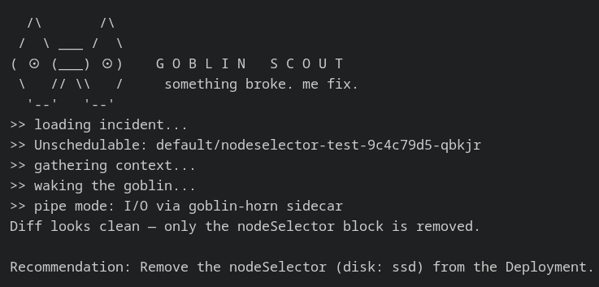

# Goblin Operator

Me goblin. Me live in cluster.

When pod die, me wake up. Me look at logs. Me look at events. Me figure out what went wrong.

Me tell you. You say yes. Me fix.



---

## What me do

- Pod OOMKilled? Me see it.
- Pod stuck Unschedulable? Me see that too.
- Me read logs, check events, look at everything.
- Me tell you what happened and what me think we should do.
- You approve. Me patch Deployment. Pod live again.

Me not touch anything without master say so.

---

## How me work

```
Pod die
  → Operator summon me
  → Me investigate
  → Me talk to you: kubectl attach -it <goblin-scout-pod>
  → You say yes → me fix
  → Me check it worked
  → Me update Remediation, me done
```

---

## How to put me in cluster

First time only. Me need images, power, and secret.

**Step 1: build me and push me**

```bash
docker compose push
```

**Step 2: install CRDs and give me power**

```bash
make -C operator deploy
```

**Step 3: give me the API key**

```bash
ANTHROPIC_API_KEY=sk-... make -C operator secret
```

Me forget key if you restart. Run again if you change it.

---

## How to summon me

Break something, me come running.

```bash
# OOMKilled
kubectl apply -f scenarios/oom-killed.yaml

# Pod stuck, no node has right label
kubectl apply -f scenarios/unschedulable-nodeselector.yaml

# Pod wants too much memory
kubectl apply -f scenarios/unschedulable-resources.yaml

# Rollout stuck
kubectl apply -f scenarios/stalled-rollout.yaml

# Namespace quota full
kubectl apply -f scenarios/quota-exceeded.yaml
```

Wait for goblin-scout pod to appear, then talk to me:

```bash
kubectl attach -it $(kubectl get pod -l job-name -o name | grep goblin-scout | head -1) -n default
```

---

## Where me live

```
operator/     me get summoned from here
agent/        me brain live here
scenarios/    things you can break to test me
```
